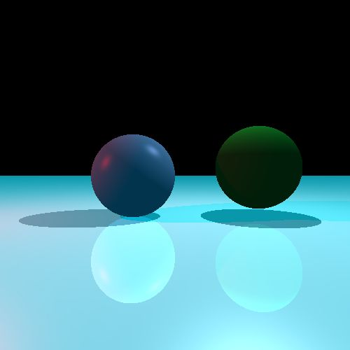

# RayTracer
A basic RayTracer written in C++, rendered as a PPM Image file

Current raytracer is non-recursive, but supports specular and diffuse materials.

## Compiling Instructions:
Using GCC
1. `gcc raytracer.cpp -o exe_name`
2a. `exe_name.exe image_name.ppm` on windows
2b. `./exename.out image_name.ppm` on Mac/Linux

## Recommended PPM viewer software:
On my Windows machine, I use XnView Classic to view the raytracer output. Check it out [here!](https://www.xnview.com/en/xnview)

On Mac, I recommend using ToyViewer. You can check it out on the Mac App Store [here!](https://apps.apple.com/us/app/toyviewer/id414298354?mt=12)

## Sample Output

